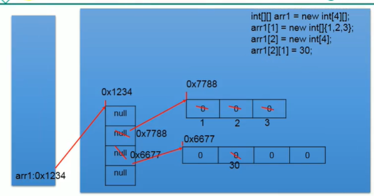
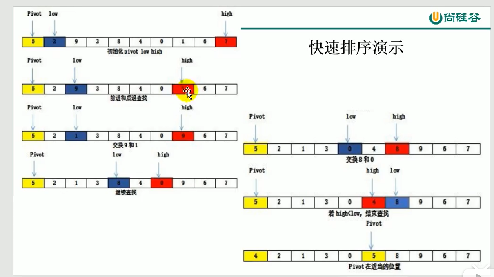
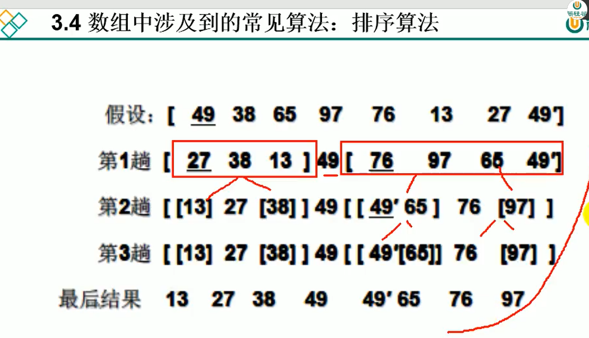

1)
int[] arr = new int[5];
String[] arr1 = new String[]{
"tom","jerry"};

arr.length 数组长度一旦初始化确定的，不可修改

2)
int[][] arr = new int[4][3];
//适合每个一维数组里面具体的元素个数不一样的情况
int[][] arr2 = new int[4][];

int[][] arr3 = new int[][]{{1,2,3},{4,5},{6,7,8}};

3)
for(int i=0;i<arr.length;i++){
   for(int j=0;j<arr[i].length;j++){
      System.out.print(arr[i][j]+ " ");
    }
   System.out.println(); 
 }
 
 数组中常见算法
 1.数组元素的赋值 杨辉三角
 2.求数值型数组中的最大值，最小值，平均数，总和
 3.数组的复制，反转，查找（线性查找，二分法查找）
 4.数组元素的排序算法
 
 快速排序：
 
 Pivot找一个数如数组第一个
 定义low 和 high指针
 当low出现指向的数大于Pivot；
 当high出现指向的数小于Pivot；
 停止移动进行交换，再继续
 
 

